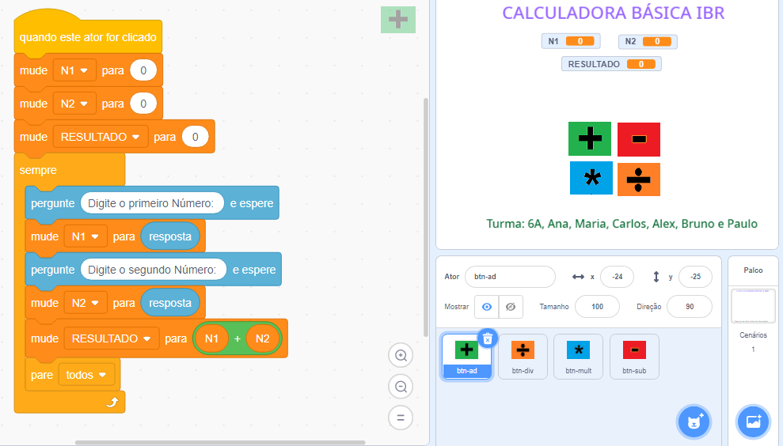

# Calculadora Básica IBR
Calculadora Básica IBR - Botões e Logo.

## Logo

## Passo a Passo da Calculadora Básica IBR  

1 - Criar uma pasta com nome Calculadora.  

2 - Criar 4 botões no Paint com tamanho de 60x47 px formato png com os nomes: 
* btn-ad, btn-sub, btn-mult e btn-div.  
* Observação: Salvar na pasta Calculadora. 
* Ou baixar os botões no link:  https://github.com/DalmoMendes/calc-ibr 

3 - Abrir o scratch2.0 e salvar o projeto na pasta Calculadora com o nome: Calc-6C-seunome. 
* 3.1 Observação: Salve as alterações a cada mudança. 
* 3.2 apagar o ator 1: gatinho. 

4 - Inserir os botões no projeto: 

5 - No Palco, Aba “Panos de Fundo”:  
* Digitar o Título no topo da tela: Calculadora Básica IBR 
* Digitar nome da turma e alunos na base: Turma: 6A, Ana, Maria, Paulo, Alex e Marcos 

6 - Organizar os botões e verificar a visualização das informações na tela. 

7 - Criar variáveis: N1, N2 e Resultado. Posicionar entre o Título e Botões. 

8 - Selecionar o botão Adição e crie os blocos para soma. 
* 8.1 - Teste a operação no botão [ + ] 

9 - Faça o mesmo processo nos demais botões alterando somente o operador. 
* Criar ou escolher uma imagem para ser a logomarca da calculadora. Tamanho: 200x186px. 

10 - Empacotar a aplicação em HTML, no TurboWarp Packager: Site:  
* https://packager.turbowarp.org/ 

11 - Compactar a pasta Calculadora. Como? 
* Clicar sobre a pasta "Calculadora" com botão direito do mouse, ir até "Enviar para", clicar em "Pasta Compactada". 

12 - Enviar a Pasta Compactada para dalmosilvamendes@gmail.com 

* Observação: 
 
Para: dalmosilvamendes@gmail.com 
Assunto: Turma 6 Ano C - Maria Santos Lima 
Mensagem: Seu nome e nome dos participantes do grupo: 

Exemplos: 

* Maria Santos Lima 
* Ana Maria Aguiar 
* Carlos Neto Gomes 
* Alex Silva Bastos 
* Luiz da Silva Neto 
* Marcos Felipe Rocha 

### Botão Adição

### Botão Subtração

### Botão Multiplicação

### Botão Divisão

## Blocos

### E-mail:
dalmosilvamendes@gmail.com
